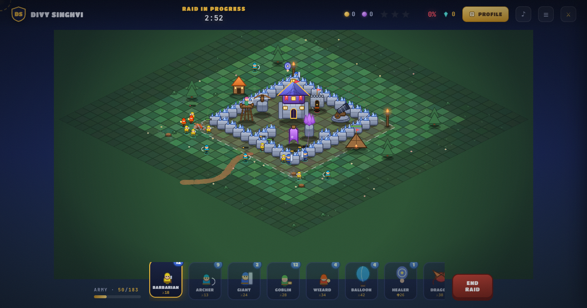

# Three Stars — a portfolio you can raid

**Play it: [divy-three-stars.vercel.app](https://divy-three-stars.vercel.app)**

My portfolio is a village. You can read it like a résumé — one click, sixty seconds —
or you can deploy an army and take it by force. Every building holds a piece of my
career as loot: destroy the beacon and you unlock Gradr, crack the X-Bow for
Kubernetes, break the storages for my projects. Three-star the base and the
village concedes.



## Two ways in

| Mode | What it is |
|---|---|
| **[Raid](https://divy-three-stars.vercel.app)** | A real-time playable attack. Eight troop types, defenses that shoot back, a clan castle that counter-attacks, spells, loot, a war log, and my actual Clash of Clans stats (TH15 · Level 189) as the economy. |
| **[Story](https://divy-three-stars.vercel.app/story/)** | The original scroll-film version — one continuous cinematic shot from the clouds to the contact form, scrubbed by your scroll wheel. |

## How to play

Pick a troop from the tray, tap the grass outside the walls. Giants tank defenses,
goblins go straight for the loot, hogs jump walls, healers keep the push alive.
The Town Hall is the first star; 50% is the second; total destruction is the third.

Secrets, because a base without secrets is a spreadsheet:
`↑↑↓↓←→←→BA` · type `hogrider`, `pekka`, `godmode`, `rage`, `freeze` · triple-tap
the Town Hall · `?auto` makes the chief raid his own base.

## How it's built

- **Zero dependencies.** One HTML file, one CSS file, one ~2,700-line `game.js`.
  No engine, no frameworks, no build step.
- **All art is code.** Every building, troop, tile, flower and icon is drawn onto
  canvases at boot — there are no image assets in the repo, and nothing borrowed
  from any game. The audio is synthesized in Web Audio, so there are no sound
  files either.
- **A real (small) game loop:** depth-sorted isometric rendering, flood-filled
  deploy legality, target-preference AI with wall-breaking, projectile and
  particle systems, a two-frame walk cycle, day that turns to dusk as the raid
  drags on.
- The résumé and the loot share one content registry — the profile panel and the
  building intel cards are the same data, so they can't drift apart.

## Run it locally

```bash
python3 -m http.server 4507
# open http://localhost:4507
```

Test harness (needs Chrome + `npm i puppeteer-core`):

```bash
node test-run.js http://localhost:4507/index.html auto   # full auto raid, fails on any console error
node test-cinematic.js http://localhost:4507/index.html  # intro sequence
node verify.js jank http://localhost:4507/story/         # story-mode scroll performance
```

---

Built by [Divy Singhvi](https://www.linkedin.com/in/divysinghvi/) — product
engineer at Gradr, Kubernetes (Minikube) contributor. Not job-hunting; happily
shipping. For open source and genuinely hard problems: gates open.
